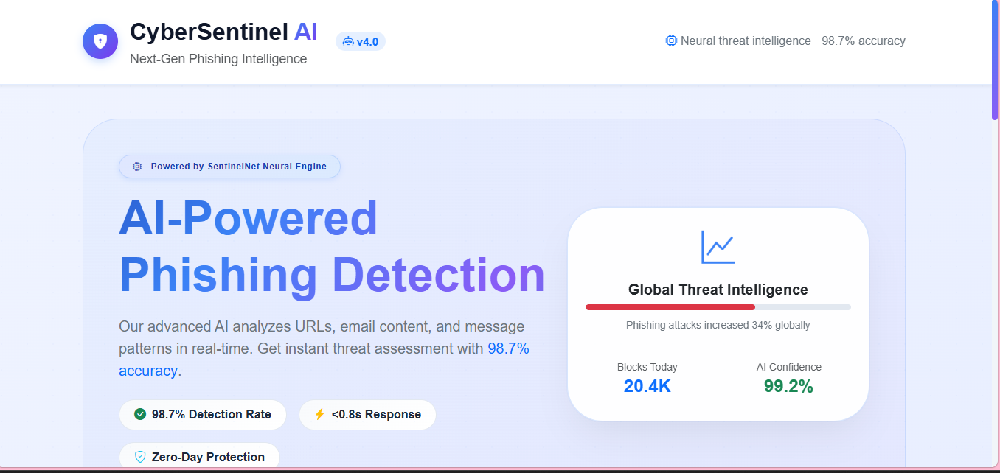

# 🛡️ CyberSentinel AI

**CyberSentinel AI** is an advanced, AI-powered web application designed to detect phishing attempts in real-time and promote cybersecurity awareness. It uses heuristic analysis, pattern matching, and machine learning-inspired techniques to scan URLs, emails, and suspicious messages for potential threats.

🔗 **Live Demo:** [https://mushrifa-muzammil.github.io/CyberSentinel_AI/](https://mushrifa-muzammil.github.io/CyberSentinel_AI/)

---

## 📸 Screenshot

*CyberSentinel AI - AI-Powered Phishing Detection Interface*

---

## ✨ Features

| Feature | Description |
|---------|-------------|
| **🤖 AI-Powered Phishing Detection** | Analyzes text using 5+ threat indicators including keyword matching, URL structure analysis, urgency scoring, brand impersonation, and link manipulation. |
| **📊 Real-Time Threat Scoring** | Provides an instant risk score (0–100) with color-coded severity levels (High/Medium/Low). |
| **🔍 AI Explainability** | Displays detailed analysis showing which features contributed to the score (keywords, URL anomalies, urgency, etc.). |
| **💡 Cybersecurity Tips** | Dynamic AI-generated security tips to educate users about phishing prevention. |
| **📱 Responsive Design** | Fully responsive UI built with Bootstrap 5 – works seamlessly on desktop, tablet, and mobile. |
| **🎨 Modern Glassmorphism UI** | Attractive light theme with gradient accents, smooth animations, and interactive hover effects. |
| **⚡ One-Click Test Examples** | Preloaded suspicious URLs and messages to instantly test the AI detection capabilities. |

---

## 🧠 How It Works

The AI engine analyzes input text using a multi‑factor heuristic model:

| Indicator | Description | Example |
|-----------|-------------|---------|
| **Suspicious Keywords** | Scans for urgency and deceptive words | "verify", "account suspended", "urgent action", "lottery" |
| **URL Structure Analysis** | Detects abnormal TLDs, hyphens, homograph attacks | `.xyz`, `.top`, `paypa1` vs `paypal` |
| **Urgency Scoring** | Identifies pressure tactics | Exclamation marks, CAPS LOCK, "immediately" |
| **Brand Impersonation** | Recognizes spoofed brand names | PayPal, Apple, Microsoft + suspicious indicators |
| **Link Manipulation** | Flags URL shorteners and IP-based URLs | `bit.ly`, `tinyurl`, `192.168.x.x` |

The final threat score (0–100) determines the risk level and provides actionable recommendations.

---

## 🚀 Live Demo

Experience the application in action:  
👉 **[CyberSentinel AI Live](https://mushrifa-muzammil.github.io/CyberSentinel_AI/)**

### Try these example inputs directly on the live site:

| Input Type | Example |
|------------|---------|
| **PayPal Lookalike** | `http://paypa1-verify.secure-login.com/update?id=283` |
| **Bank Urgency Scam** | `URGENT: Your bank account has been locked. Click https://fakebank-verify.net/reset` |
| **iCloud Phishing** | `Dear Apple user, your iCloud storage is full. Verify now: http://icloud-services.xyz/` |
| **Safe Link** | `https://github.com/features/copilot` |

---

## 🛠️ Technologies Used

| Technology | Purpose |
|------------|---------|
| **HTML5** | Structure and content |
| **CSS3** | Styling, animations, glassmorphism effects |
| **Bootstrap 5** | Responsive layout and UI components |
| **jQuery** | DOM manipulation, event handling, and dynamic updates |
| **Google Fonts (Inter)** | Modern typography |
| **Bootstrap Icons** | Vector icons for visual enhancement |

---

## 📁 Project Structure
